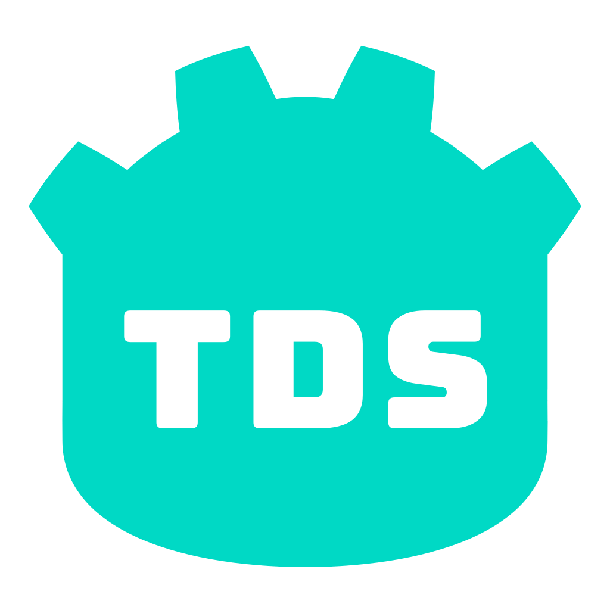

# Godot TDS

Godot plugin for supporting TapTap Developer Services

在 Godot 中使用 TapTap 开发者服务

# Version

- OpenJDK 17.0.11
- TapSDK Android 4.5.5
- TapADN Android SDK 3.16.3.45
- Godot 4.4

# Feature

### TapSDK

- [ ] 登录
- [ ] 合规认证
- [ ] 内嵌动态
- [ ] 悬浮窗
- [ ] 成就系统
- [ ] 礼包系统
- [ ] 排行榜
- [ ] 云存档
- [ ] 深度链接

### TapAD

- [ ] 开屏广告
- [ ] 激励广告
- [ ] 横幅广告
- [ ] 信息流广告
- [ ] 插屏广告

# How to use

[B站视频讲解](void(0))

example 目录下存放的是用于展示插件功能的 Godot 项目

GodotTDS 目录下存放的是用于生成***安卓插件***的安卓项目

# Thanks

[B站岩岩大佬](https://space.bilibili.com/55245483)

[B站咲夜大佬](https://space.bilibili.com/2706229)
